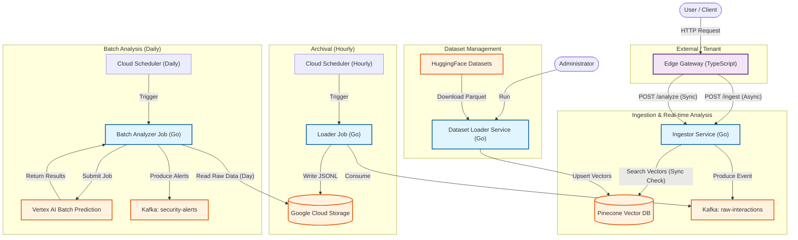

# Application Architecture

The following diagram describes the high-level architecture and data flow of the Reflex application, including the ingestion pipeline, archival process, batch analysis, and dataset management.

