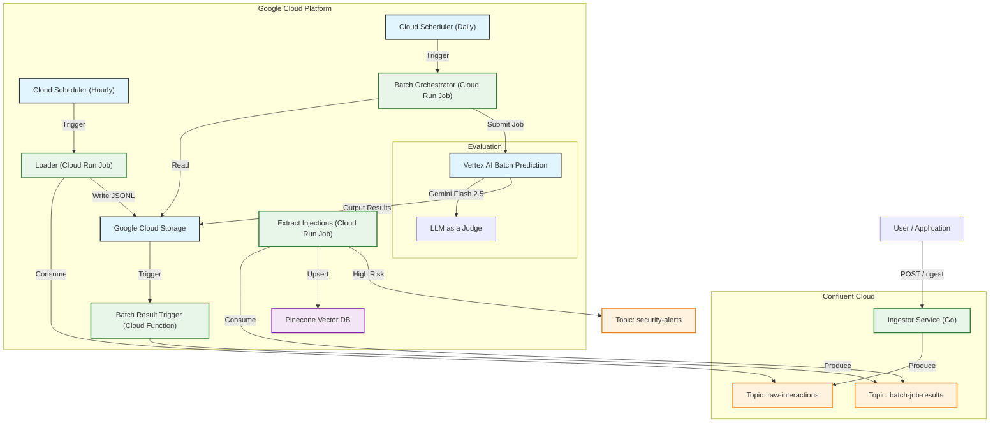

```mermaid 
graph TD
    User["User / Application"] -->|POST /ingest| Ingestor["Ingestor Service (Go)"]
    
    subgraph "Confluent Cloud"
        Ingestor -->|Produce| RawTopic["Topic: raw-interactions"]
        BatchResultTopic["Topic: batch-job-results"]
    end
    
    subgraph "Google Cloud Platform"
        SchedulerLoader["Cloud Scheduler (Hourly)"] -->|Trigger| Loader["Loader (Cloud Run Job)"]
        Loader -->|Consume| RawTopic
        Loader -->|Write JSONL| GCS["Google Cloud Storage"]

        SchedulerBatch["Cloud Scheduler (Daily)"] -->|Trigger| BatchJob["Batch Orchestrator (Cloud Run Job)"]
        
        BatchJob -->|Read| GCS
        BatchJob -->|Submit Job| VertexAI["Vertex AI Batch Prediction"]
        
        subgraph "Evaluation"
            VertexAI -- Gemini Flash 2.5 --> Judge["LLM as a Judge"]
        end
        
        VertexAI -->|Output Results| GCS
        
        GCS -->|Trigger| TriggerFn["Batch Result Trigger (Cloud Function)"]
        TriggerFn -->|Produce| BatchResultTopic
        
        ExtractJob["Extract Injections (Cloud Run Job)"] -->|Consume| BatchResultTopic
        ExtractJob -->|Upsert| Pinecone["Pinecone Vector DB"]
    end
    
    ExtractJob -->|High Risk| AlertsTopic["Topic: security-alerts"]
    
    classDef cloud fill:#e1f5fe,stroke:#333,stroke-width:2px;
    classDef confluent fill:#fff3e0,stroke:#f57f17,stroke-width:2px;
    classDef go fill:#e8f5e9,stroke:#2e7d32,stroke-width:2px;
    classDef db fill:#f3e5f5,stroke:#7b1fa2,stroke-width:2px;
    
    class Ingestor,Loader,BatchJob,TriggerFn,ExtractJob go;
    class RawTopic,BatchResultTopic,AlertsTopic confluent;
    class GCS,VertexAI,SchedulerLoader,SchedulerBatch cloud;
    class Pinecone db;
```